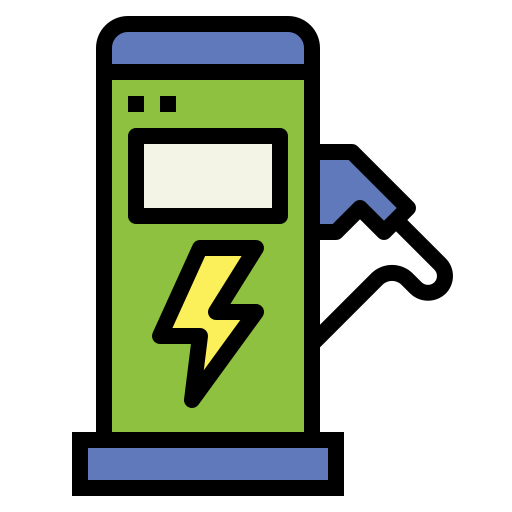

<p align="center">
  
</p>

<h1 align="center">⚡ EV Charging Station Management - Frontend ⚡</h1>

This is the **Vue 3** frontend for the **EV Charging Station Management System**. It provides a user-friendly interface to manage, view, and interact with charging stations via the backend API.

---

## 🚀 Tech Stack

- 🧩 **Vue 3** — Progressive JavaScript Framework  
- ✨ **TypeScript** — Typed JavaScript at Scale  
- 🌐 **Vue Router** — Declarative Routing  
- 📦 **Pinia** — State Management for Vue  
- 🎨 **Tailwind CSS** — Utility-First Styling  
- 🗺️ **Leaflet** — Interactive Mapping  
- 🔥 **Axios** — Promise-based HTTP Client  
- 🔔 **Vue3-Toastify** — Toast Notifications  
- ⚡ **Vite** — Lightning-fast Build Tool

---

## 🌟 Key Features

- 🔐 **User Authentication** – JWT-based login & registration  
- 📊 **Dashboard** – Charging stats & quick actions  
- 🧭 **Station Listing** – Filter by status, type, power  
- 🛠️ **Add/Edit/Delete Stations** – With map-based location selector  
- 🗺️ **Map View** – Leaflet map with station markers  
- 📱 **Responsive UI** – Tailwind mobile-first design  
- 📣 **Global Notifications** – Toast alerts for user feedback  

---

## ⚙️ Getting Started

### ✅ Prerequisites

- [Node.js](https://nodejs.org/) (v14 or later)  
- Backend server running and accessible

---

### 📦 Installation

```bash
cd frontend
npm install

